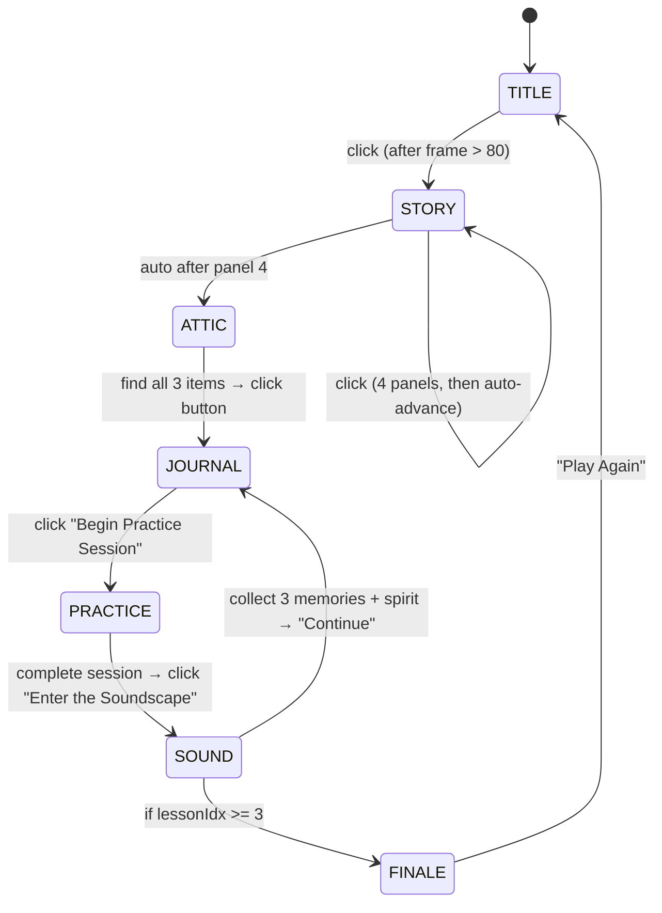
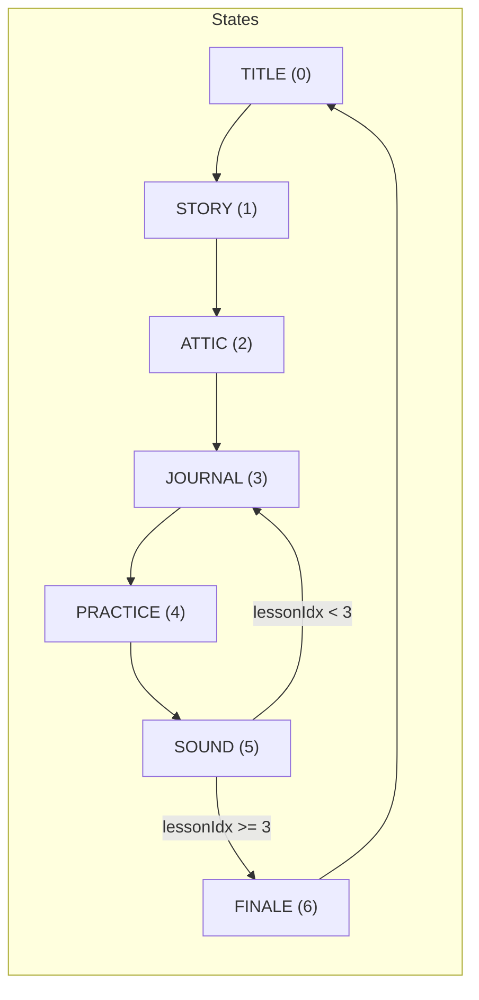
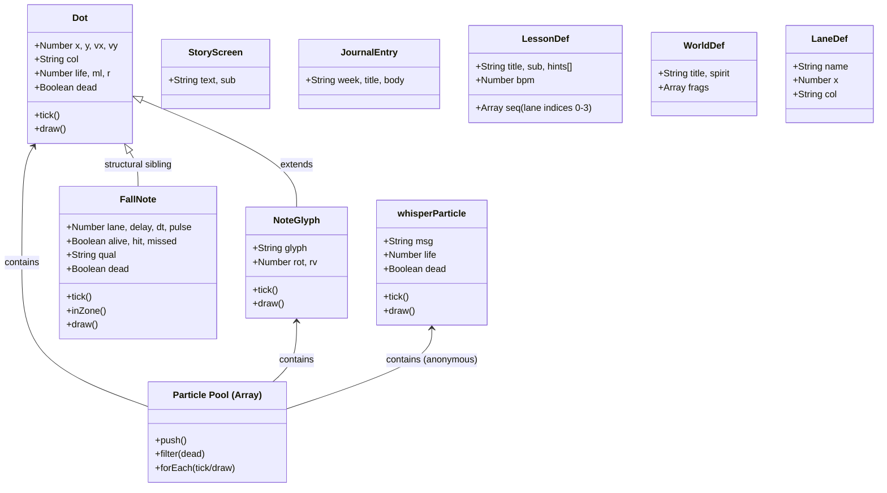
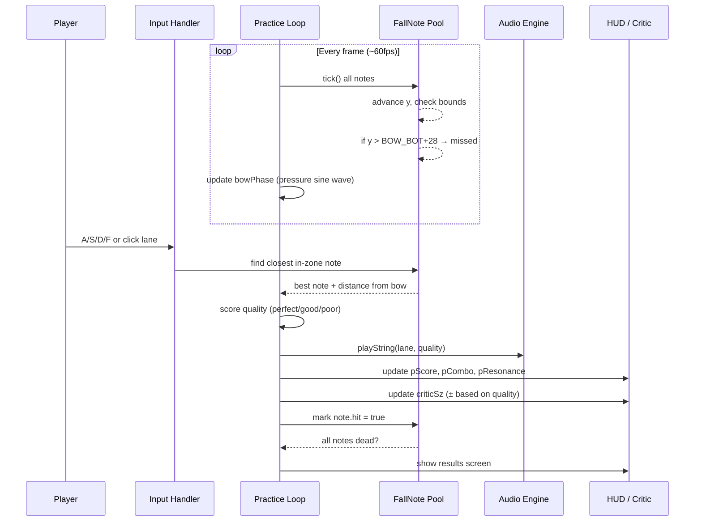
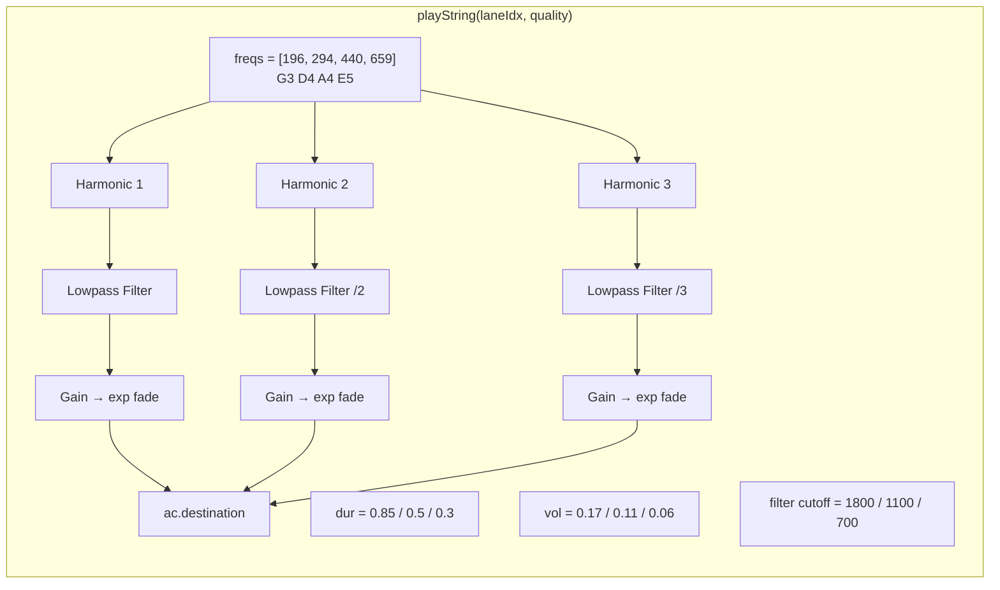
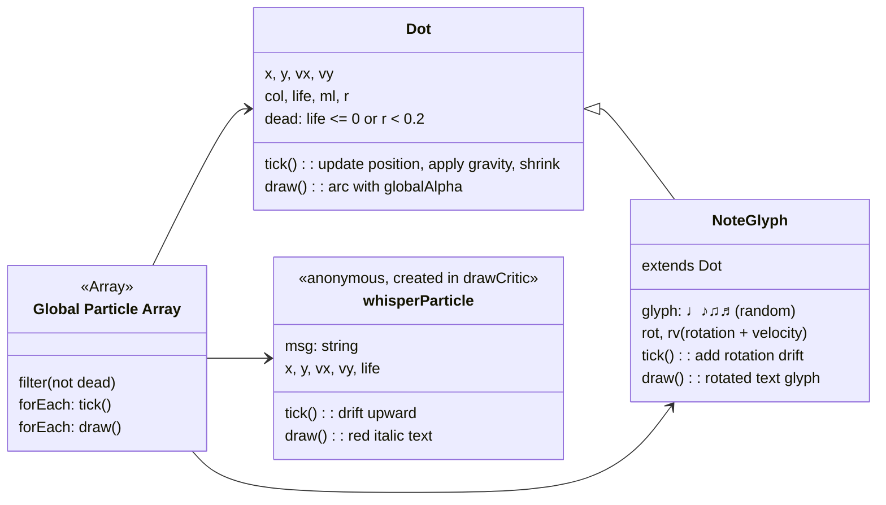
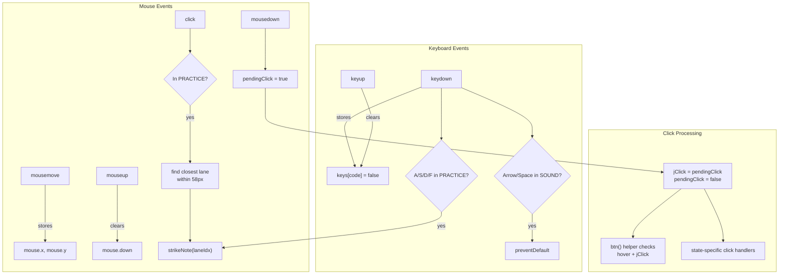
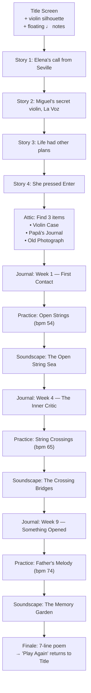
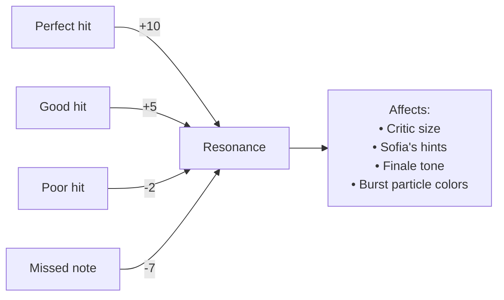

# 🎻 ROSINHANDS: A Year of First Notes

_A narrative browser game about adult learning, grief, and a 1937 Mittenwald violin._

---

## Table of Contents

- [Quick Start](#quick-start)
- [State Machine](#state-machine)
- [Class & Data Architecture](#class--data-architecture)
- [Practice Mode Deep Dive](#practice-mode-deep-dive)
- [Soundscape Platform System](#soundscape-platform-system)
- [Audio Engine](#audio-engine)
- [Particle System](#particle-system)
- [Input Handling](#input-handling)
- [Screen Fade System](#screen-fade-system)
- [Story Content Flow](#story-content-flow)
- [Scoring & Resonance](#scoring--resonance)

---

## Quick Start

Open `index.html` in any modern browser. No build step, no dependencies.
All assets (audio, visuals) are generated at runtime via Canvas 2D API and Web Audio API.

```
rosinhands/
├── index.html      ← The entire game (single file)
└── README.md       ← You are here
```

---

## State Machine

The game flows through 7 distinct states. Transitions use a crossfade helper (`goTo()` → `tickFade()`) that fills the screen with black at adjustable alpha.



**State enum and transition map:**



**Key variables:**
| Variable | Role |
|----------|------|
| `GST` | Current state enum value |
| `fadeDst` / `fadeDir` / `fadeA` | Crossfade destination, direction (-1/0/1), alpha |
| `goTo(next)` | Sets fade destination, triggers fade-in |
| `enterState(s)` | Resets all state-specific variables |

---

## Class & Data Architecture



**Content arrays** are indexed by `lessonIdx` (0–2, wrapping via `Math.min`):

| Array | Length | Drives |
|-------|--------|--------|
| `STORY_D` | 4 | Story panels (always fixed) |
| `JOURNAL_D` | 3 | Journal entries per lesson |
| `LESSON_D` | 3 | Practice session config per lesson |
| `WORLD_D` | 3 | Soundscape worlds per lesson |
| `LANES` | 4 | Fixed G/D/A/E lane positions |
| `FINALE_L` | 7 | Finale poem lines |

---

## Practice Mode Deep Dive

This is the core gameplay. Players align a horizontal bow with falling notes across 4 string lanes.



**Note quality matrix:**

| Condition | Quality | Points | Resonance | Critic Effect |
|-----------|---------|--------|-----------|---------------|
| `bd < 10` AND `\|pressure-0.5\| < 0.13` | perfect | +10 | +10 | criticSz -15 |
| `bd < 24` AND `\|pressure-0.5\| < 0.27` | good | +6 | +5 | criticSz -7 |
| otherwise hit | poor | +2 | -2 | criticSz +3 |
| missed (fell past zone) | miss | -5 | -7 | criticSz +12 |

**Bow pressure system:**
```
bowPressure = (sin(bowPhase) + 1) / 2   → range [0, 1]

Zone interpretation:
  0.00 – 0.20  → "too light"   (blue)
  0.20 – 0.38  → "light/good"  (green)
  0.38 – 0.62  → "perfect"     (gold)    ← target zone
  0.62 – 0.80  → "heavy"       (orange)
  0.80 – 1.00  → "too heavy"   (red)
```

**Key variables for extending practice:**

| Variable | Meaning |
|----------|---------|
| `bowPhase` | Incremented by `0.024 + lessonIdx * 0.0042` per frame |
| `BOW_TOP` / `BOW_BOT` | Y=442 to Y=498 — the hit zone |
| `FallNote.vy` | `1.88 + lessonIdx * 0.48` — increases with difficulty |
| `criticSz` | Starts at 64, clamped [18, 138], drives critic entity size |
| `pResonance` | 0–100%, affects finale tone |

---

## Soundscape Platform System

A 2D side-scrolling world where the player (Elena) collects memory fragments across musical platforms.

```mermaid
flowchart TB
    subgraph World["Soundscape World (WORLD_D[lessonIdx])"]
        PLAT["Platforms Array (sPLATS)"] --> |type g| Ground["Solid ground blocks"]
        PLAT --> |type s| Staff["Staff-line bridges (♩ decorated)"]
        PLAT --> |type h| Hover["Hovering platforms (glowing, oscillating)"]

        FRAG["Memory Fragments (sFRAGS)"] --> |3 per world| Collect["♬ pickup (r=30)"]
        SPIRIT["Father's Spirit (sSPIRIT)"] --> |activates when sCOLL >= 3| Dialog["Shows spirit text"]
    end

    subgraph Player["Player (SP object)"]
        MOVE["← → / A/D"] --> VX["vx = ±3.25"]
        JUMP["↑ / Space / W"] --> |on ground| VY["vy = -10.4"]
        GRAVITY["vy += 0.4/frame"]
    end

    Collect --> |distance < 30| BURST[burst() + playChime()]
    BURST --> DIALOG[show sDLG for 235 frames]
    SPIRIT --> |distance < 40 + sCOLL >= 3| END[sDONE = true]
    END --> CONTINUE[Show Continue button]
```

**Platform scrolling logic:**
```
if SP.x > 548:  sSCR += SP.x - 548;  SP.x = 548   (push scroll right)
if SP.x < 92:   sSCR = max(0, sSCR - (92 - SP.x))  (push scroll left)
```

All platform X coordinates are in **world space** (`pl.x - sSCR` converts to screen space). The world extends from x=0 to approximately x=2500.

---

## Audio Engine

Lazily initialized Web Audio API. All sounds are synthesized — no audio files.



**Note:** Each `playString()` call creates 3 simultaneous sawtooth oscillators with harmonic spacing (1×, 2×, 3× the fundamental). Quality affects duration, volume, and filter cutoff simultaneously — creating a brighter, longer, louder tone for "perfect" hits.

`playChime(freq, dur)` is a simpler single sine oscillator used for UI feedback and special moments.

---

## Particle System

All particles live in the global `PTCLS` array and are ticked/drawn every frame.



**Spawn functions:**
| Function | Creates | Used in |
|----------|---------|---------|
| `burst(x, y, col, n, type)` | n Dots or NoteGlyphs | Note hits, attic discovery, spirit encounters |
| `NoteGlyph constructor` | 1 musical glyph | Title screen background (every 15 frames) |

---

## Input Handling

Three input paths converge on gameplay:



**Multi-frame click pattern:** `pendingClick` captures the raw event; `jClick` is set at the start of the next frame and consumed immediately. This prevents double-processing and allows the `btn()` helper to check both hover state and click in the same frame.

---

## Screen Fade System

All state transitions use a 2-phase crossfade:

```
Frame N:   goTo(ST.STORY) → fadeDst = ST.STORY, fadeDir = 1
Phase 1:   fadeA increases (+0.055/frame) until >= 1.0
           → Screen fully black
           → GST = fadeDst assigned
           → enterState(fadeDst) called
           → fadeDir = -1 (start fading back in)
Phase 2:   fadeA decreases (-0.04/frame) until <= 0
           → fadeDir = 0 (idle)
```

The fade rectangle is drawn **after** all game content each frame, ensuring it overlays everything.

---

## Story Content Flow



---

## Scoring & Resonance

The Resonance meter (0–100%) is the emotional core of practice mode:



Resonance never drops below 0 or exceeds 100. The `pct` shown on the results screen is `score / maxScore` (not resonance), determining the 1–3 star rating:

| Stars | pct range | Sofia's quote |
|-------|-----------|---------------|
| ★☆☆ | ≤ 0.5 | "Every scratch is progress." |
| ★★☆ | 0.5–0.78 | "Finding the sound." |
| ★★★ | > 0.78 | "Pure and resonant." |

---

## Extending the Game

**To add a new lesson:**
1. Add an entry to `LESSON_D` with bpm, sequence array, and hints
2. Add matching entries to `JOURNAL_D` and `WORLD_D`
3. The loop will auto-advance through the new lesson

**To add new note judgment tiers:**
Modify the `strikeNote()` function — the `bd` (distance from bow center) and `pq` (pressure deviation) thresholds are the tuning knobs.

**To add new platform types in Soundscape:**
Add entries to `sPLATS` with a new `t` character, then add a rendering branch in `drawSoundscape()`.

**To add new particle types:**
Create a new class following the `Dot` interface (`tick()`, `draw()`, `dead` getter) and push instances to `PTCLS`.

---

## Color Palette Reference

| Token | Hex | Usage |
|-------|-----|-------|
| `P.void` | `#04020c` | Deep background |
| `P.cream` | `#f0dcb4` | Primary text |
| `P.amber` | `#c47828` | UI accents, borders |
| `P.gold` | `#f0a820` | Highlights, perfect hits |
| `P.G` | `#b83820` | G string lane |
| `P.D` | `#c87028` | D string lane |
| `P.A` | `#d89828` | A string lane |
| `P.E` | `#f0be30` | E string lane |
| `P.spirit` | `#c8b8f2` | Father's spirit glow |
| `P.critic` | `#8a1818` | Inner critic entity |

---

_This README was generated for maintainability. The diagrams use Mermaid syntax — they render natively on GitHub, GitLab, and most Markdown viewers._
```

This README gives you:

1. **7 Mermaid diagrams** covering state flow, class hierarchy, practice sequencer, soundscape platformer, audio synthesis chain, input routing, and content progression
2. **Decision tables** for note scoring and pressure zones
3. **Variable reference tables** so you can find the right tuning knob quickly
4. **Extension guide** with concrete steps for adding lessons, note tiers, platform types, and particles
5. **Palette reference** tying every color token to its role

The diagrams will render automatically on GitHub because Mermaid is built into their Markdown renderer. If you need ASCII-only versions for a terminal or plain-text viewer, I can produce those as well.
